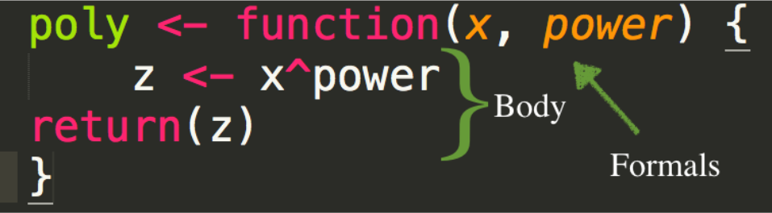

```{r setup, include=FALSE}
knitr::opts_chunk$set(echo = TRUE)
library(here)
library(rio)
library(tidyverse)
library(broom)
library(glue)
```

The following script can be used to import the data we will use for this example.

```{r import}
drug_by_year <- import(here("data", "drug_by_year.csv"),
                       setclass = "tbl_df")
recent_drug <- import(here("data", "2015_drug_dep.csv"),
                      setclass = "tbl_df")
```

1. `drug_by_year` includes data from 2005 to 2015 and reports on the people who responded yes to using illicit substances in the last year. 

2. `recent_drug` includes has data from 2015-2016 and shows the age of first drug use, a summed depression score, whether or not participants have been to rehab, have access to mental health services, and have health insurance. 

## Putting it All Together


When you move to working with your own data in the real-world, often you need to address complex questions that may not perfectly align with either a custom function that you wrote or a variant of `map()`. In these cases, it is often useful to synthesize or combine the functions together in order to create a viable solution to the question you are trying to address. In this last post, we are going to do exactly that by using `pmap()` and a custom function to create a trove of custom plots! Finally, we will go over how to save these plots into a file. But before we do, let's review what we have learned so far.  

### Purr

At the beginning of this tutorial, we started out by learning how to use the `purr` package to apply useful arguments (e.g., `round`) to multiple items in a list through the `map()` function. 
We then learned how `map()` and its variant `map_df()` can be utilized to iterate through data frames. 
Additionally, we found out in the case of parallel iteration, the functions `map2_*` and `pmap_*` can be used to iterate through more than a single input. 

### Functions

Functions allow us to create custom solutions to any problem we are addressing independent of a pre-made package. Remember, anything that carries out an operation is a function, however, for our purposes we go beyond this definition by using the *body* and *formals* descriptions to better define how to formulate a function. 

  

## Application 

In this final section, we want to use `pmap()` to build custom plots that are able to visualize data across multiple inputs from a list. The question that we are looking to answer is:
  * How does average depression levels differ for males vs females across ethnicity. 
Answering this question in a singular plot would be pretty simple. But what if we want to answer this question but also see how these differences look across income levels and mental health services. 
That is Where the use of `pmap()` enters the picture!
Before we apply `pmap()` we first want to nest our data into a list where the variables of interest (i.e., sex, ethnicity, depression levels) are nested within both mental health and income levels. 

```{r echo = TRUE}
#transforming data to work with
dat <- recent_drug %>% 
  select(-1:-2, -age_stim) %>%
  gather(drug, age_use, -age, -sum_depression:-sex) %>%
  separate(drug, c("dis", "drug"), sep = "_") %>%
  select(-dis) %>% 
  filter(!is.na(age_use)) %>% 
  mutate(mental_health = ifelse(mental_health == "Yes", "Yes", "No"),
         sex = fct_relevel(sex, ref = "Male"),
         mental_health = fct_relevel(mental_health, ref = "No"))

dat_1 <- dat %>%
  #get rid of the variables we are not going to use
  select(-age, -rehab, -insurance, -age_use, -drug) %>%
  filter(!is.na(mental_health)) %>% 
  filter(!is.na(income) |
           income != "Refused" |
           income != "Don't know") %>% 
  #nest the remaining variables of interest within income and mental health
  nest(-income, -mental_health)
```

Now we use `pmap()` and our anonymous function to create a set of custom plots. In order to apply the function across the variables of mental health and income levels, we will use the `glue` package. 

```{r}
plots <- dat_1 %>%
  # The first step is to use mutate to apply the pmap function on the variables we will be iterating through and then write an anonymous function using the specifications from pmap
  mutate(plots = pmap(list(data = dat_1$data, income = dat_1$income, mental_health = dat_1$mental_health), function(data, income, mental_health) {
    # Now we will embed the ggplot code within the body of our function
    ggplot(dat) + 
    geom_bar(aes(ethnicity, sum_depression, fill = sex), stat = "summary", fun.y = "mean", position = "dodge", alpha = 0.7) +
      # Add aesthetics to the plot
      theme_minimal() +
      scale_fill_viridis_d() +
      coord_flip() +
      # in the labels section use the glue argument to iterate across income for the titles and mental health sercies for caption. 
      labs(title = glue("Depression Scores for Individuals Making {income}"), 
           subtitle = "Comparison across sex and ethnicity", 
           caption = glue("Access to mental health services: {mental_health}"), 
           y = "Mean Depression Score", x = "Ethnicity")
  }))
#showing access to mental health services as a 1 or 2, instead of yes vs no. 
```

There are now 27 plots that visualize our question of interest across mental health and income levels by using the `glue` package. Note that the plots are saved as a list within the object "plots." Thus, to access the plots we would 
  * specify the object "plots"
  * access the list "plots" by using the $ operation
  * enter the number of which plot we want to view
To test our code, we can randomly select any number from 1-27: 

```{r}
plots$plots[[27]]
plots$plots[[10]]
```

Finally, we want to save our work! To do this we combine the different skills we have learned including `glue` and `walk2`

```{r eval = FALSE}
# create an object files that uses meaningful names for the plots
files <- str_replace_all(tolower(plots$income), " ", "-")
# create the plot folder 
fs::dir_create(here::here("plots"))
# use the glue function to apply the object files to each plot
paths <- here::here("plots", glue("{files}.png"))
# walk2 specifies the path and sizes of plots 
walk2(paths, plots$plots, ggsave,
      width = 9.5, height = 6.5, dpi = 500)
#only saved 15 plots instead of th 44. It is because I am saving it by income only, how do I had the mental health services also?
```
